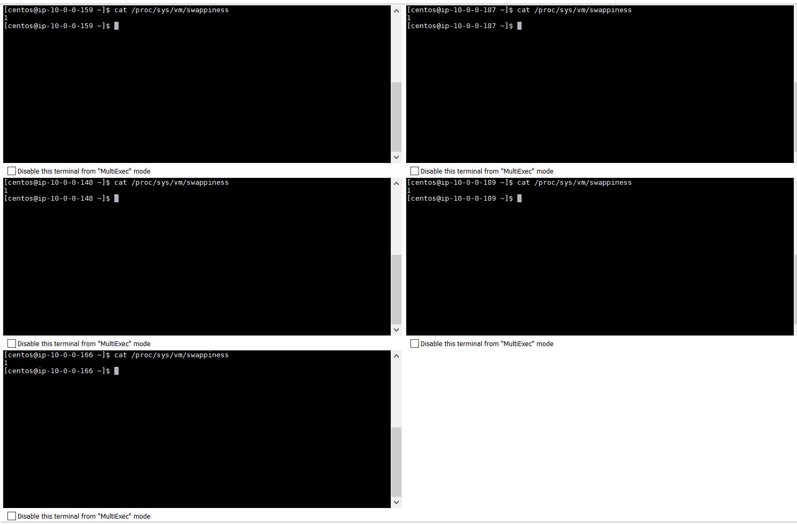
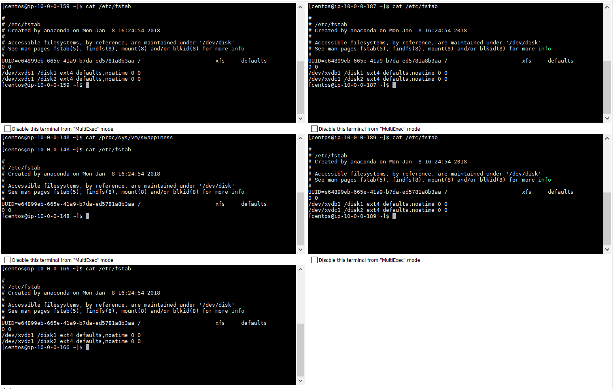
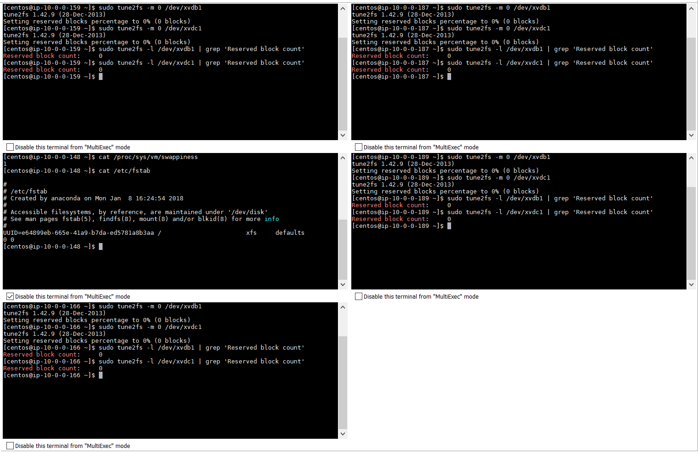
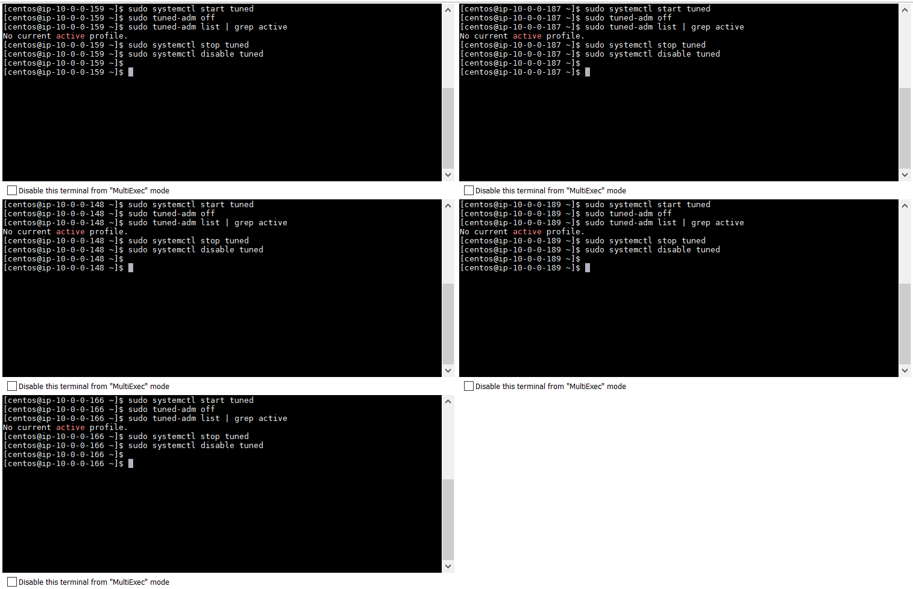
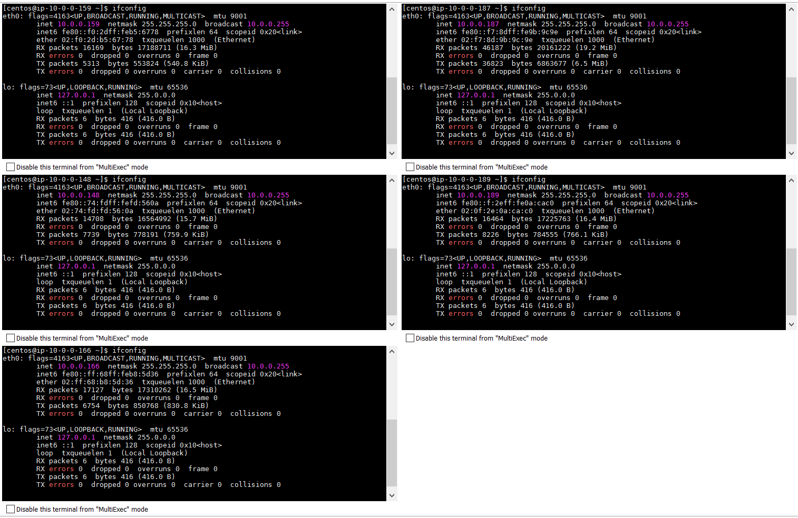
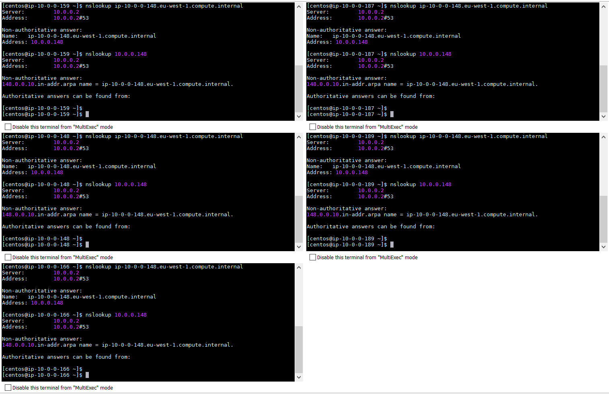
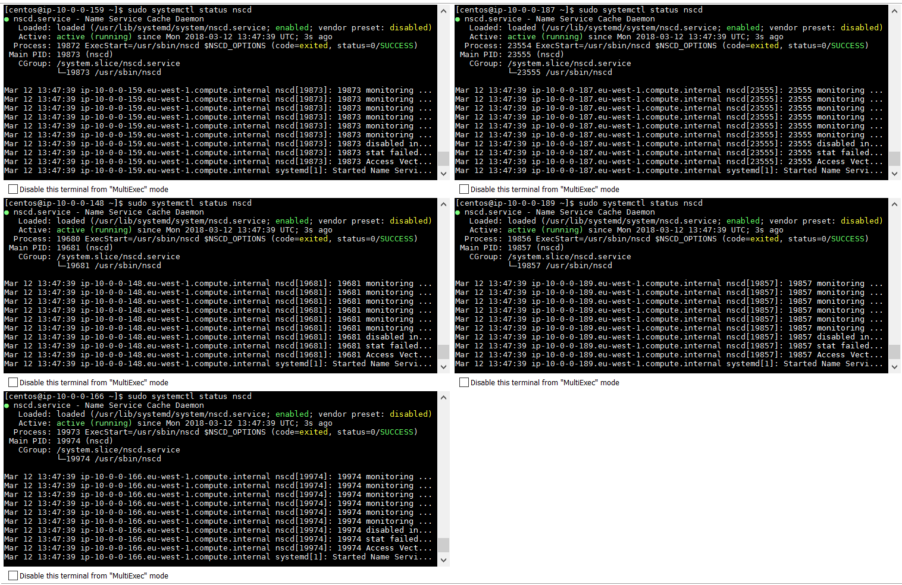
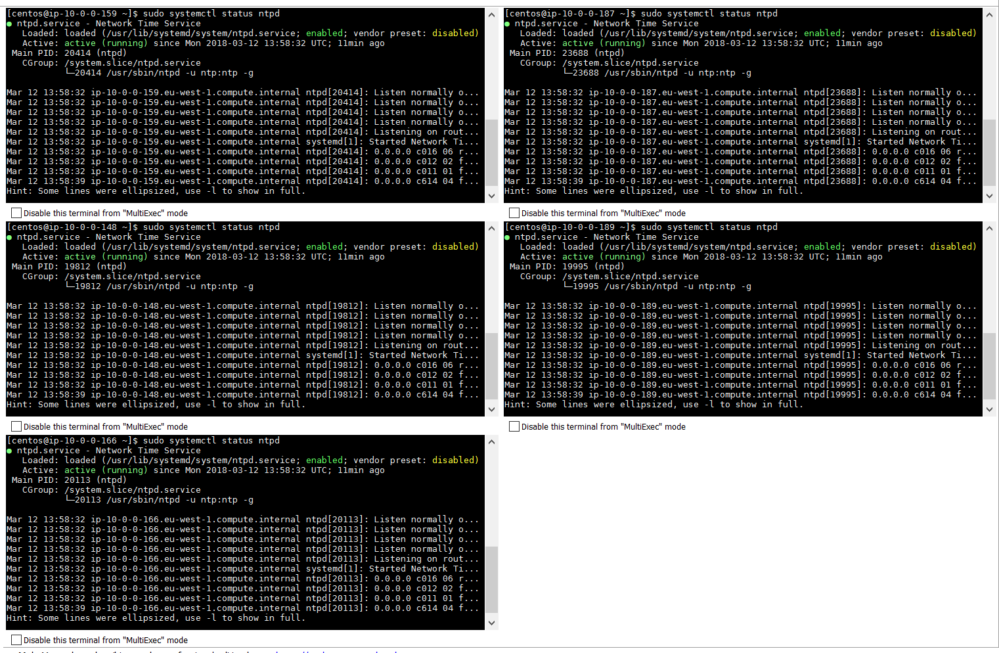

# Check vm.swappiness on all your nodes
Modify swappiness for this boot
<code>sudo sysctl -w vm.swappiness=1</code>

Modify swappiness for future boots
```
sudo vi /etc/sysctl.conf</code>
  vm.swappiness=1</code>
```


# Show the mount attributes of your volume(s)
I create a couple of volumes extra for my datanades to store hdfs data.
10.0.0.148 is going to be my edge node, so it has only one partition


# If you have ext-based volumes, list the reserve space setting
```
sudo tune2fs -m 0 /dev/xvdb1
sudo tune2fs -l /dev/xvdb1 | grep 'Reserved block count'
```


# Disable transparent hugepage support
Disable THP on reboot
```
chmod +x /etc/rc.d/rc.local
vi /etc/rc.d/rc.local
  echo never > /sys/kernel/mm/transparent_hugepage/enabled
  echo never > /sys/kernel/mm/transparent_hugepage/defrag
```

I'm on a CentOS 7 so I need an extra step
```
sudo vi /etc/default/grub
  transparent_hugepage=never
sudo grub2-mkconfig -o /boot/grub2/grub.cfg
```

Disable THP in this boot
```
sudo sh -c "echo 'never' > /sys/kernel/mm/transparent_hugepage/enabled"
sudo sh -c "echo 'never' > /sys/kernel/mm/transparent_hugepage/defrag"
```

Disable Tuned


# List your network interface configuration


# Show that forward and reverse host lookups are correctly resolved


# Show the nscd service is running
Install service
<code>sudo yum -y install nscd</code>

Start in reboot
<code>sudo systemctl enable nscd</code>

Start for this boot
<code>sudo systemctl start nscd</code>

Verify


# Show the ntpd service is running
Install it
<code>sudo yum -y install ntp</code>

Add servers
```
sudo vi /etc/ntp.conf
  server 0.europe.pool.ntp.org
  server 1.europe.pool.ntp.org
  server 2.europe.pool.ntp.org
  server 3.europe.pool.ntp.org
```

Start service
```
sudo chkconfig ntpd on
sudo service ntpd start
```

Synchronize servers
```
ntpdate -u europe.pool.ntp.org
hwclock --systohc
```

Verify

