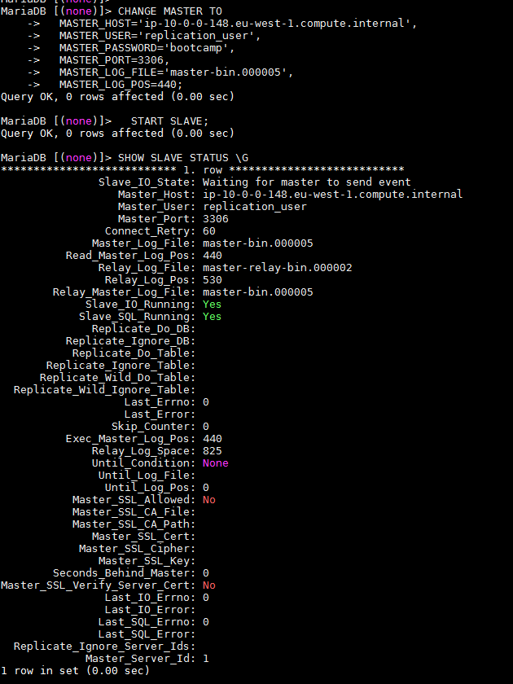

#Install the mysql-server in master and slave
Install and configure /etc/my.conf
```
sudo yum -y install mariadb-server
sudo vi /etc/my.conf
```
Content of the /etc/my.conf
```
[mysqld]
transaction-isolation = READ-COMMITTED
# Disabling symbolic-links is recommended to prevent assorted security risks;
# to do so, uncomment this line:
# symbolic-links = 0

key_buffer = 16M
key_buffer_size = 32M
max_allowed_packet = 32M
thread_stack = 256K
thread_cache_size = 64
query_cache_limit = 8M
query_cache_size = 64M
query_cache_type = 1

max_connections = 550
#expire_logs_days = 10
#max_binlog_size = 100M

#log_bin should be on a disk with enough free space. Replace '/var/lib/mysql/mysql_binary_log' with an appropriate path for your system
#and chown the specified folder to the mysql user.
log_bin=/var/lib/mysql/mysql_binary_log
binlog_format = ROW
server_id=1 !!!!!!!!!!!!!!!!!!!!!!!!!!!!!!!!!!!!!!!!!!!!!!! 2 for slave
log-basename=master

read_buffer_size = 2M
read_rnd_buffer_size = 16M
sort_buffer_size = 8M
join_buffer_size = 8M

# InnoDB settings
innodb_file_per_table = 1
innodb_flush_log_at_trx_commit  = 2
innodb_log_buffer_size = 64M
innodb_buffer_pool_size = 4G
innodb_thread_concurrency = 8
innodb_flush_method = O_DIRECT
innodb_log_file_size = 512M

[mysqld_safe]
log-error=/var/log/mariadb/mariadb.log
pid-file=/var/run/mariadb/mariadb.pid
```

Start Services
```
sudo systemctl enable mariadb
sudo systemctl start mariadb
```

Configure root user
Yes to all except "disallow root to conect remotely"
```
/usr/bin/mysql_secure_installation
sudo systemctl restart mariadb
```

# Configure Master
```
mysql -u ... -p
  GRANT REPLICATION SLAVE ON *.* TO 'replication_user'@'ip-10-0-0-166.eu-west-1.compute.internal' IDENTIFIED BY 'bootcamp';
  SET GLOBAL binlog_format = 'ROW'; 
  FLUSH TABLES WITH READ LOCK;
  SHOW MASTER STATUS;
  UNLOCK TABLES;
```

# Configure Slave
```
mysql -u ... -p
  CHANGE MASTER TO
    MASTER_HOST='ip-10-0-0-148.eu-west-1.compute.internal',
    MASTER_USER='replication_user',
    MASTER_PASSWORD='bootcamp',
    MASTER_PORT=3306,
    MASTER_LOG_FILE='master-bin.000005',
    MASTER_LOG_POS=440;
  START SLAVE;
  SHOW SLAVE STATUS \G
```


# Configure clients in all machines
Install client
<code>sudo yum -y install mariadb</code>

Donload JDBC Driver
```
wget https://dev.mysql.com/get/Downloads/Connector-J/mysql-connector-java-5.1.45.tar.gz
tar zxvf mysql-connector-java-5.1.45.tar.gz
sudo mkdir -p /usr/share/java/
sudo cp mysql-connector-java-5.1.45/mysql-connector-java-5.1.45-bin.jar /usr/share/java/mysql-connector-java.jar
```