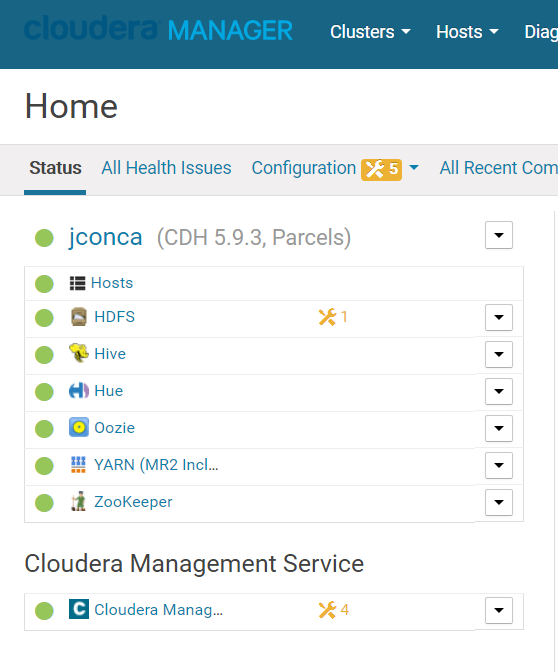

# Path B install using CM 5.9.x
Install a supported Oracle JDK on your first node
Install a supported JDBC connector on all nodes <= Already done in mysql configuration
Create the databases and access grants you will need
Configure Cloudera Manager to connect to the database
Start your Cloudera Manager server -- debug as necessary
Do not continue until you can browse your CM instance at port 7180

Configure repo for CM 5.9.x
```
wget https://archive.cloudera.com/cm5/redhat/7/x86_64/cm/cloudera-manager.repo
sudo vi cloudera-manager.repo
  5 => 5.9
sudo cp cloudera-manager.repo /etc/yum.repos.d/
```
Install a supported Oracle JDK and Cloudera manager on your first node
```
sudo yum -y install oracle-j2sdk1.7
sudo yum install -y cloudera-manager-daemons cloudera-manager-server
```

Create the databases and access grants you will need
```
sudo /usr/share/cmf/schema/scm_prepare_database.sh mysql -uroot -pbigsecr3t scm scm scm
mysql -u root -p
  create database amon DEFAULT CHARACTER SET utf8;
  grant all on amon.* TO 'amon'@'%' IDENTIFIED BY 'amon';
  create database rman DEFAULT CHARACTER SET utf8;
  grant all on rman.* TO 'rman'@'%' IDENTIFIED BY 'rman';
  create database metastore DEFAULT CHARACTER SET utf8;
  grant all on metastore.* TO 'hive'@'%' IDENTIFIED BY 'hive';
  create database sentry DEFAULT CHARACTER SET utf8;
  grant all on sentry.* TO 'sentry'@'%' IDENTIFIED BY 'sentry';
  create database hue default character set utf8 default collate utf8_general_ci;
  grant all on hue.* to 'hue'@'%' identified by 'hue';
  create database oozie default character set utf8;
  grant all privileges on oozie.* to 'oozie'@'localhost' identified by 'oozie';
  grant all privileges on oozie.* to 'oozie'@'%' identified by 'oozie';
sudo mkdir -p /var/lib/oozie
sudo cp mysql-connector-java-5.1.45/mysql-connector-java-5.1.45-bin.jar /var/lib/oozie/
```

# Install a cluster and deploy CDH
Follow CM wizard.
Node 1 => MySQL Master, CM, Hue, JobHistory, NameNode, Balancer, Metastore, Zookeeper
Node 2 => MySQL Slave, SecondaryNameNode, Resource Manager, Hive Server, Oozie, Zookeeper
Node 3 => Zookeeper, DataNode, NodeManager
Node 4 => DataNode, NodeManager
Node 5 => DataNode, NodeManager

Warning is because NameNode has less than 4GB of memory assigned
