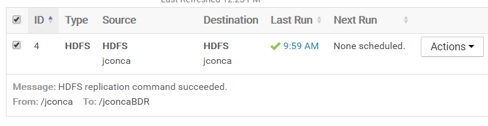

#Use teragen to create a 500 MB file
I have 3 Datanodes with two dedicated disks, so i use 6 mappers

<code>yarn jar /opt/cloudera/parcels/CDH/lib/hadoop-mapreduce/hadoop-mapreduce-examples.jar teragen  -Ddfs.replication=1 -Dmapreduce.job.maps=6 5242880 /jconca</code>

It creates the following files
```
[jconca@ip-10-0-0-148 centos]$  hdfs dfs -ls -h /jconca
Found 7 items
-rw-r--r--   1 hdfs supergroup          0 2018-03-13 09:43 /jconca/_SUCCESS
-rw-r--r--   1 hdfs supergroup     83.3 M 2018-03-13 09:43 /jconca/part-m-00000
-rw-r--r--   1 hdfs supergroup     83.3 M 2018-03-13 09:43 /jconca/part-m-00001
-rw-r--r--   1 hdfs supergroup     83.3 M 2018-03-13 09:43 /jconca/part-m-00002
-rw-r--r--   1 hdfs supergroup     83.3 M 2018-03-13 09:43 /jconca/part-m-00003
-rw-r--r--   1 hdfs supergroup     83.3 M 2018-03-13 09:43 /jconca/part-m-00004
-rw-r--r--   1 hdfs supergroup     83.3 M 2018-03-13 09:43 /jconca/part-m-00005

```

#Copy your partner's file to your target directory
I use my partners public ip to access their NameNode
<code>hadoop distcp /jconca hdfs://104.196.167.212:8020/jconca</code>
The command fails after a long time, we try with a smaller dataset (1MB) and it also fails with this message
```
Caused by: org.apache.hadoop.ipc.RemoteException(java.io.IOException): File /jconca/.distcp.tmp.attempt_1520933211815_0006_m_000001_0 could only be replicated to 0 nodes instead of minReplication (=1).  There are 3 datanode(s) running and 3 node(s) are excluded in this operation.
```

Partner's NameNode responses  with DataNodes internal adresses and my cluster can reach them. I fill /etc/hosts  file in all nodes with their public ips associated to their internal adresses. Unfortunately we have the same error.

DataNodes service are atached to our internal network interface so it's not reachable form outside, so we continue with the backup from my cluster to my cluster

<code>hadoop distcp /jconca /jconcaDistCP</code>

I also use the Backup utilitiy from Cloudera Manager.


# Browse the results
The three folders are similar, distcp ones has a diferent block replication. Perhaps i must use -p[rbugpcaxt] options
```
[hdfs@ip-10-0-0-148 centos]$ hdfs fsck /jconca -files -blocks | grep Average ; hdfs fsck /jconcaDistCP -files -blocks | grep Average; hdfs fsck /jconcaBDR -files -blocks | grep Average ;
Connecting to namenode via http://ip-10-0-0-148.eu-west-1.compute.internal:50070
 Average block replication:     1.0
Connecting to namenode via http://ip-10-0-0-148.eu-west-1.compute.internal:50070
 Average block replication:     3.0
Connecting to namenode via http://ip-10-0-0-148.eu-west-1.compute.internal:50070
 Average block replication:     1.0
```