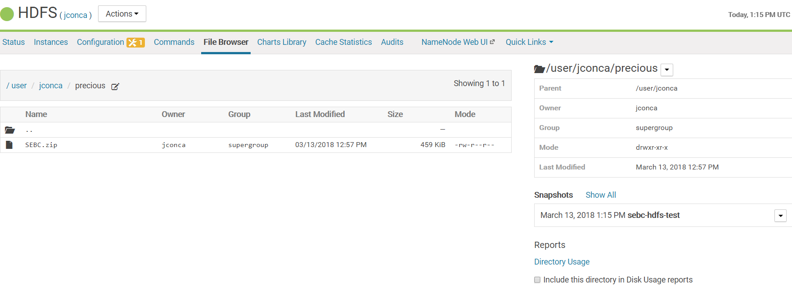
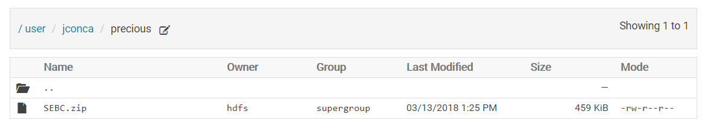
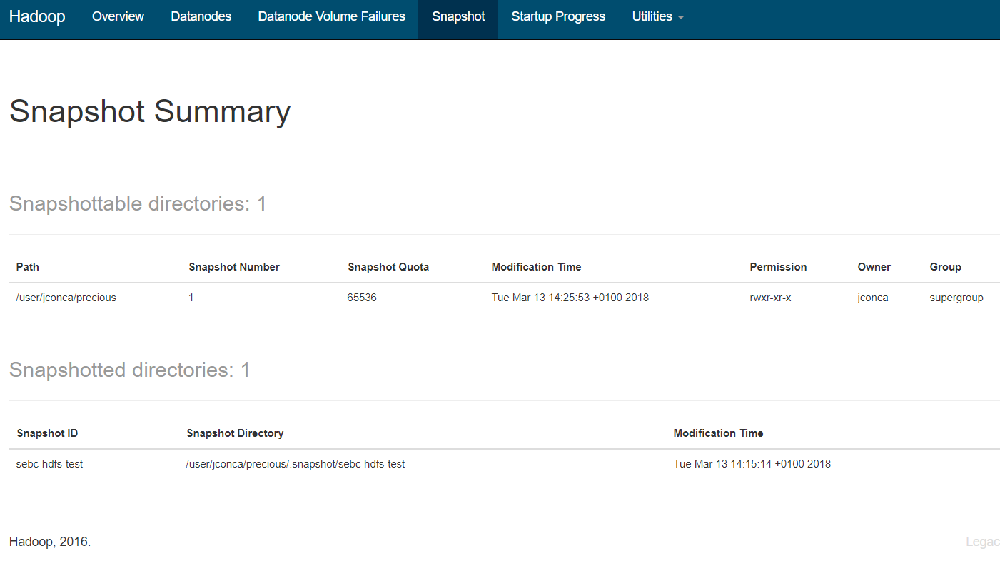

#Create a precious directory in HDFS; copy the ZIP course file into it.
```
[jconca@ip-10-0-0-148 centos]$ hdfs dfs -mkdir precious
[jconca@ip-10-0-0-148 ~]$ hdfs dfs -put /tmp/SEBC.zip precious
[jconca@ip-10-0-0-148 ~]$ hdfs dfs -ls precious
Found 1 items
-rw-r--r--   3 jconca supergroup     470034 2018-03-13 12:57 precious/SEBC.zip
```
# Enable snapshots for precious AND Create a snapshot called sebc-hdfs-test


# Delete the directory
```
[jconca@ip-10-0-0-148 ~]$ hdfs dfs -rm -R precious
rm: Failed to move to trash: hdfs://ip-10-0-0-148.eu-west-1.compute.internal:8020/user/jconca/precious: The directory /user/jconca/precious cannot be deleted since /user/jconca/precious is snapshottable and already has snapshots
```

# Delete the zip file
```
[jconca@ip-10-0-0-148 ~]$ hdfs dfs -rm precious/SEBC.zip
18/03/13 13:22:09 INFO fs.TrashPolicyDefault: Moved: 'hdfs://ip-10-0-0-148.eu-west-1.compute.internal:8020/user/jconca/precious/SEBC.zip' to trash at: hdfs://ip-10-0-0-148.eu-west-1.compute.internal:8020/user/jconca/.Trash/Current/user/jconca/precious/SEBC.zip
```

# Restore the deleted file


# Capture the NameNode web UI screen that lists snapshots

