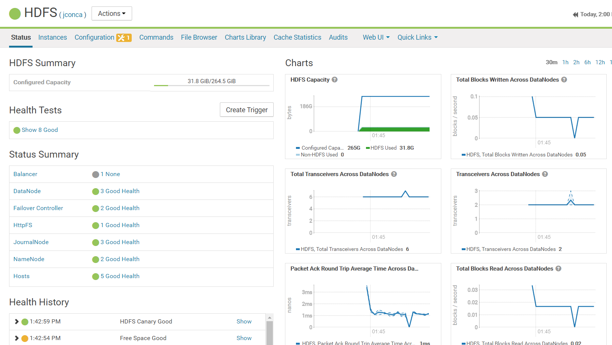
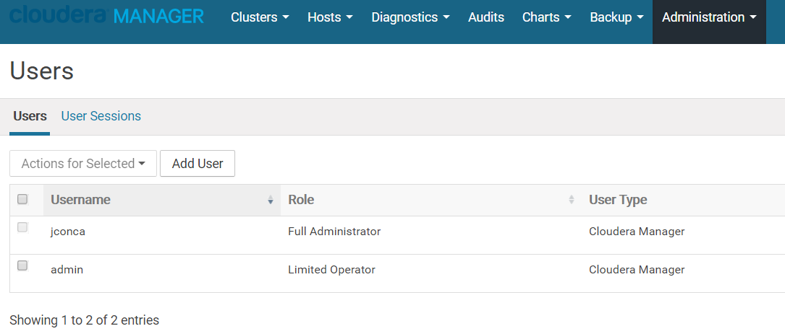

#Use the Cloudera Manager wizard to enable HA
I follow the wizard installing an additional NameNode in the server with ResourceManager and the JournalNodes in the same servers with Zookeeper.
I follow the instructions to update Hive Metastore.
I follow the instructions to add the HttpFs filesystem in the server with the additional NameNode and configure Hue to use this service.

# Add a CM user and name it with your GitHub handle
To modify admin user I had to logout and login with the new user.
